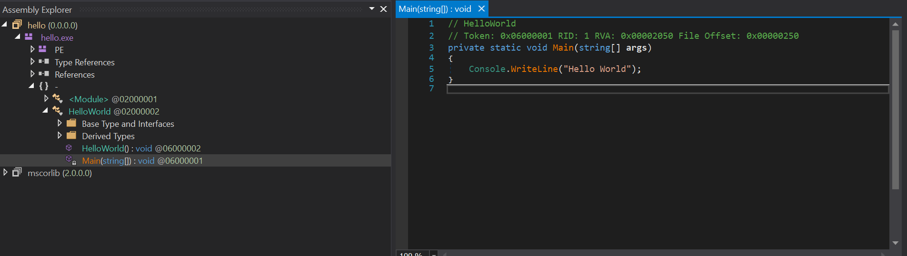
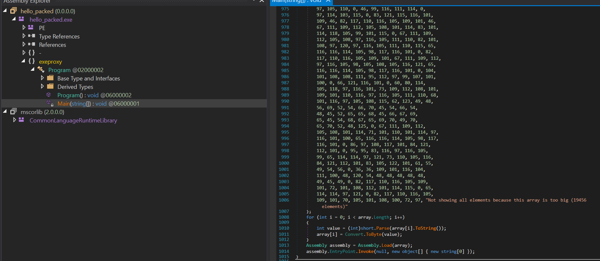

# chasrp_packer

## setup
    put csc in you env 
    https://stackoverflow.com/questions/6660512/how-to-get-csc-exe-path
## usage 

    .\pack.ps1 <file_name> <packed_name> <number of packed>
    file_name: your charp exe file
    packed_name: the output name
    number of packed: the number of packed times more numebr more protected and size will get bigger (10 it's good enough but you can put 100)

    Example: 
    .\pack.ps1 hello.exe hello_packed.exe 13

# before pack

# before packed

